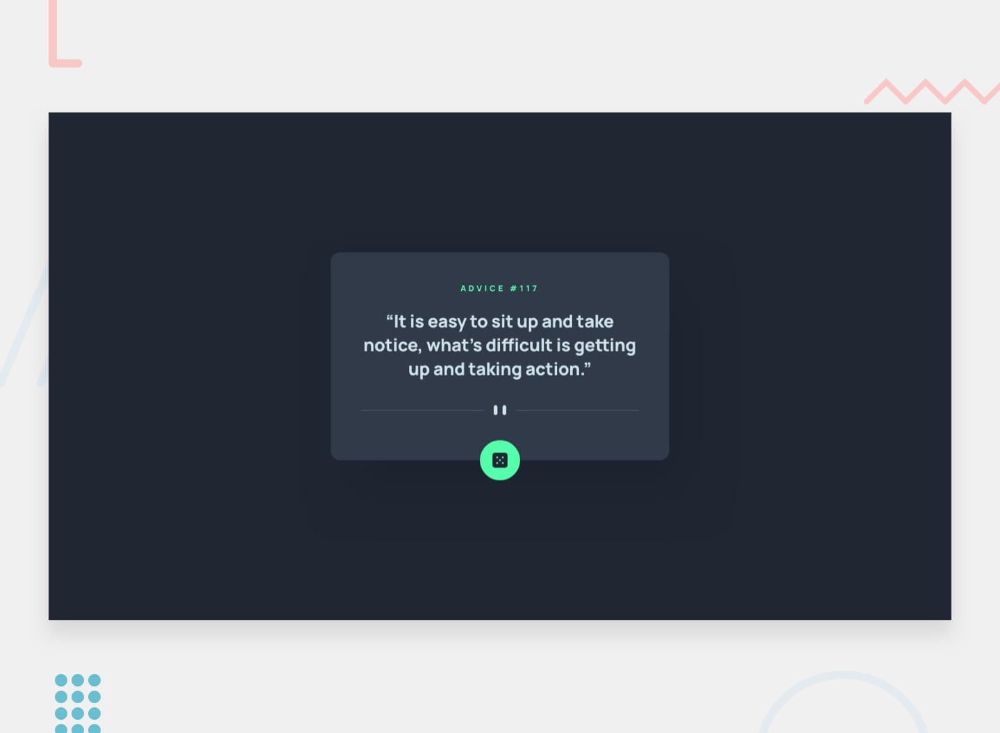

## Hello, everyone! ✌

This is my **Day 13** of the [Frontend Mentor](https://www.frontendmentor.io/home) Challenge endurance.

Thanks for checking out this front-end coding challenge. This is the Live preview solution of the [Advice Generator App](https://www.frontendmentor.io/challenges/advice-generator-app-QdUG-13db) challenge by [Frontend Mentor](https://www.frontendmentor.io/home). 

## Focusig on 👀

* A Simple Advice generator turned a bit elegant!
* Appealing Front end design as for a fashionable **Itty-bitty App**.
* A Touch of `Javascript` and `Advice Slip API`. 
* Built and fashioned with `Tailwind CSS`.

## If you wanna 💡

**Tip-off** you can surely ping me anytime [here](#find-me-elsewhere-%F0%9F%93%B1 "Goto Find me elsewhere 📱")

**Create a clone** feel free to [fork](https://github.com/Aravinthvimal/Advice-Generator-App) into or click on the challenge link.

**Cherish** unfortunately you gotto go to the top again, and press the star button!

## Find me elsewhere 📱

[Instagram](https://www.instagram.com/_.ken__adams_/)

[LinkedIn](https://www.linkedin.com/in/aravinth-vimal-1120581a7/)

[Frontend Mentor](https://www.frontendmentor.io/profile/Aravinthvimal)
